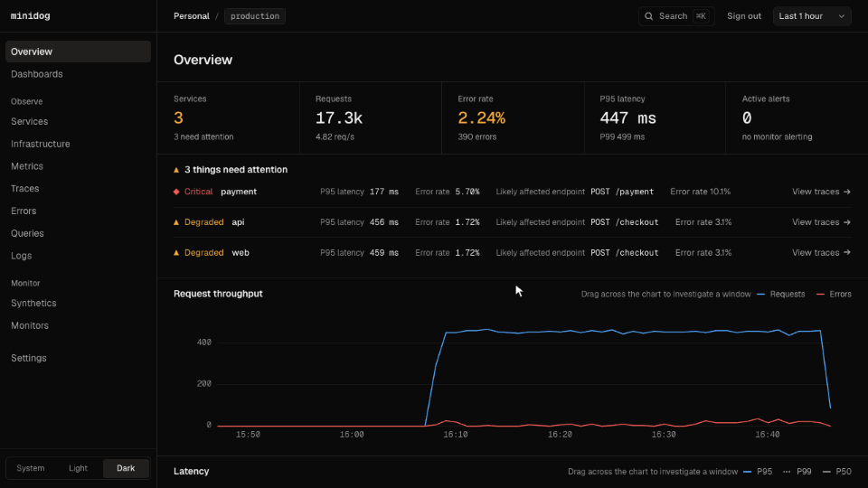

<div align="center">

# minidog

**1인 개발자의 사이드 프로젝트를 위한 셀프 호스팅 Observability**<br>
업타임 체크, 트레이스, 로그, 지표, 휴대폰 알림을 Docker Compose 파일 하나로. OpenTelemetry와 ClickHouse 기반.

[](https://github.com/yohan-work/minidog/releases)
[](https://github.com/yohan-work/minidog/actions/workflows/ci.yml)
[](LICENSE)
[](https://opentelemetry.io)

[English](README.md) · [한국어](README.ko.md)

</div>



## 왜 만들었나

사이드 프로젝트가 몇 개 있으면, 하나가 죽었을 때 알고 싶고, 느려졌을 때는 *왜* 느린지 알고 싶습니다. 보통은 업타임 체커, 로그 뷰어, 무료 한도가 금방 차는 호스팅 APM을 따로따로 붙여야 합니다.

minidog은 한 번 설치로 두 질문에 답합니다.

> **뭔가 느리다 → 어느 서비스 → 어느 엔드포인트 → 어느 span → 어느 로그 한 줄**

- **파일 하나로 설치.** `docker compose up -d` 하고 비밀번호만 정하면 됩니다. 호스트마다 에이전트를 깔 필요도, 가입할 필요도 없습니다.
- **OpenTelemetry로 받음, 전용 SDK 없음.** Node, Python, Go, Java, 이미 쓰는 Collector 등 OTLP를 보내는 것은 모두 됩니다.
- **노트북에 맞춤.** 컴퓨터가 잠자기 중이었거나 minidog이 꺼져 있던 시간은 장애가 아니라 *측정 못 함*으로 표시합니다. 노트북을 열자마자 가짜 알림이 오지 않습니다.
- **휴대폰 알림 무료.** Slack, Discord, Telegram, [ntfy](https://ntfy.sh) 토픽으로 보내고, 하루 요약도 받을 수 있습니다.

## 빠른 시작

Docker만 있으면 됩니다.

```bash
mkdir minidog && cd minidog
curl -fsSLO https://raw.githubusercontent.com/yohan-work/minidog/main/deploy/compose.yaml
docker compose up -d
```

**http://localhost:3000** 을 열고 비밀번호를 정합니다. 호스트 지표는 15초 안에 들어오기 시작합니다. 트레이스·로그·에러를 바로 보고 싶다면 샘플 트래픽을 보내는 데모 가게(서비스 3개)를 켜세요.

```bash
docker compose --profile demo up -d
```

업데이트는 `docker compose pull && docker compose up -d`로 합니다. 특정 릴리스로 고정하려면 `MINIDOG_VERSION=0.2.0`을 지정하세요.

## 기능

| | |
|---|---|
| **Synthetics** | 상태 코드, 지연, 가용성, SSL 만료일을 확인하는 HTTP 체크입니다. 리다이렉트를 따라가고 본문에 특정 문구가 있는지도 확인합니다. |
| **APM** | 서비스·엔드포인트, P50/P95/P99, span waterfall이 있는 트레이스, 서비스 맵, `service.version`별 배포 표시선을 보여줍니다. |
| **에러·쿼리** | 예외를 종류와 메시지로 묶어 보여줍니다. 느린 DB 쿼리는 값을 `?`로 바꿔 순위로 보여줍니다. |
| **로그** | 검색과 실시간 보기를 지원합니다. 로그는 트레이스로, 트레이스는 로그로 이어집니다. |
| **인프라** | Collector가 모은 호스트 CPU·메모리·디스크·네트워크 지표와 지표 탐색기를 제공합니다. |
| **모니터** | 에러율, 지연, 서비스 다운, 호스트 자원, 체크 실패를 Warning/Critical 단계로 알립니다. N분 지속된 뒤에만 알리거나, 점검 중에는 음소거할 수 있습니다. |
| **일상 사용** | 대시보드, ⌘K 검색, 차트를 드래그해 그 구간의 느린 트레이스 보기, 라이트·다크 테마, 신호별 보관 기간 설정. |

[실행 가이드](docs/getting-started.ko.md)에서 데모 가게로 하나씩 따라 해 볼 수 있습니다.

## 내 서비스의 텔레메트리 보내기

어떤 OpenTelemetry SDK든 함께 제공되는 Collector를 가리키게 하면 됩니다.

```bash
export OTEL_EXPORTER_OTLP_ENDPOINT=http://localhost:4318
export OTEL_SERVICE_NAME=my-api
```

Node.js는 코드 수정 없이 자동 계측을 바로 쓸 수 있습니다.

```bash
npm i @opentelemetry/auto-instrumentations-node
node --require @opentelemetry/auto-instrumentations-node/register app.js
```

API 키 없이 보낸 데이터는 기본 프로젝트로 들어갑니다. 특정 프로젝트와 환경으로 보내려면 **Settings**에서 키를 만들고 `OTEL_EXPORTER_OTLP_HEADERS`에 `x-minidog-api-key`로 넣으세요.

## 자원 사용량

Apple silicon Mac, Docker Desktop에서 함께 제공되는 저메모리 ClickHouse 설정으로, 켜고 1분 뒤에 잰 값입니다.

| | 메모리 | 이미지(압축) |
|---|---|---|
| 대시보드 | 42 MB | 68 MB |
| API | 45 MB | 57 MB |
| ClickHouse | 300 MB (상한 1 GiB) | 234 MB |
| OpenTelemetry Collector | 51 MB | — |

합계는 약 440 MB이고, 데이터와 쿼리가 늘면 ClickHouse가 1 GiB 상한까지 커질 수 있습니다. 아주 작은 에이전트는 아닙니다.

## 나에게 맞을까?

minidog은 **한 사람이 프로젝트 몇 개를 지켜보는 용도**입니다. 사용자·권한·SSO가 없어서 팀용은 아니고, 기본적으로 localhost에서만 열리므로 인터넷에 공개하는 용도도 아닙니다. 다른 필요에는 이런 도구가 더 낫습니다.

- **업타임 체크만:** [Uptime Kuma](https://github.com/louislam/uptime-kuma)가 더 가볍고 알림 종류도 훨씬 많습니다.
- **서버 지표만:** [Beszel](https://github.com/henrygd/beszel)은 작은 에이전트와 허브로 됩니다.
- **팀이나 대규모 운영:** [SigNoz](https://github.com/SigNoz/signoz)와 [HyperDX](https://github.com/hyperdxio/hyperdx)는 같은 기술 위의 본격적인 플랫폼입니다.

## 보안

처음 접속할 때 비밀번호를 정하고, 그다음부터 모든 화면과 Query API에 로그인이 필요합니다. 모든 포트는 127.0.0.1에만 열립니다. 체크와 웹훅은 링크 로컬·클라우드 메타데이터 주소에 절대 연결하지 않습니다. 비밀번호를 잊었다면 `docker compose exec api node cli/reset-password.mjs`를 실행하세요. 보안 모델과 취약점 제보 방법은 [SECURITY.md](SECURITY.md)에, 인터넷에 열지 않고 다른 기기에서 접속하는 방법은 [서버에서 운영하기](docs/getting-started.ko.md#서버에서-운영하기)에 있습니다.

## 백업

비밀번호, API 키, 모니터, 대시보드는 작은 SQLite 파일 하나에 들어 있습니다(텔레메트리는 ClickHouse에 있고 보관 기간이 지나면 지워집니다). 이 파일은 minidog이 켜져 있어도 언제든 복사할 수 있습니다.

```bash
docker compose exec api node cli/backup.mjs /data/minidog-$(date +%F).sqlite
```

되돌리는 방법을 포함한 자세한 내용은 [백업하기](docs/getting-started.ko.md#백업하기)에 있습니다. `docker compose down -v`는 볼륨을 모두 지우므로 텔레메트리뿐 아니라 설정도 사라집니다.

## 문서

- [실행 가이드](docs/getting-started.ko.md) ([English](docs/getting-started.md)): 설정, 항상 켜두기, 소스로 실행, 데모 가게, 휴대폰 알림
- [Architecture](docs/architecture.md): 구성 요소와 어디를 고치면 되는지
- [Contributing](CONTRIBUTING.md), [Changelog](CHANGELOG.md), [Code of conduct](CODE_OF_CONDUCT.md)

## 로드맵

- [ ] Heartbeat / cron 모니터: 작업이 신호를 안 보내면 알림
- [ ] 기준 비교: "P95 ↑ 312% vs 지난주"
- [ ] LLM 호출: OpenTelemetry `gen_ai` span으로 토큰·비용 보기

아이디어와 투표는 [issues](https://github.com/yohan-work/minidog/issues)에 남겨 주세요.

## 라이선스

[MIT](LICENSE). minidog은 Datadog과 관련 없는 독립 프로젝트입니다.
